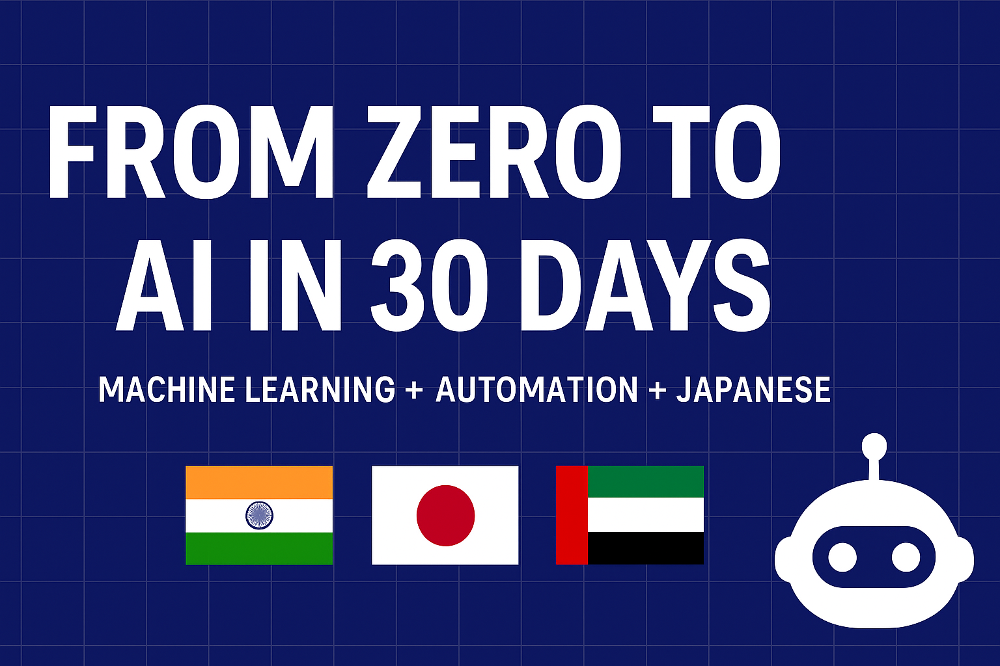

# 🚀 From Zero to AI in 30 Days — Atul Bharat Ghadge

Hi there! 👋 I’m **Atul Bharat Ghadge**, a fast-learning, automation-driven developer on a 30-day mission to go from **no machine learning background** to building **real-world AI + n8n automation projects** for India, Japan, and Dubai.

💡 My belief: *Skills are built in the doing.*  
🛠 My approach: *Learn → Build → Deploy → Share.*

---

## 📅 30-Day Challenge
I’m publicly documenting my journey of learning:
- **Machine Learning** (Python, scikit-learn, Hugging Face, Streamlit)
- **n8n Automation** (workflows, integrations, bots)
- **Japanese Language (N5 & N4)** for cross-cultural projects

---

## 📂 Featured Projects
### 1️⃣ AI Resume Screener + n8n Automation  
Rank resumes for a given job description and auto-send shortlisted results via email/Google Sheets.

### 2️⃣ AI Social Media Sentiment Analyzer (Japanese + English)  
Analyze tweets/posts in both languages to detect trends and sentiment.

### 3️⃣ Real Estate Price Predictor for Dubai  
Predict property prices and generate a PDF report via automation.

---

## 🌏 Why Me?
- **Speed Learner:** Building 3 production-ready AI projects in just 30 days.  
- **Multi-Market Focus:** India 🇮🇳 | Japan 🇯🇵 | Dubai 🇦🇪  
- **Automation First:** Saving time and effort with n8n workflows.

---

## 📬 Let’s Connect
- **LinkedIn:** [linkedin.com/in/atul-ghadge](https://linkedin.com/in/atul-ghadge)  
- **Email:** atulghadge2003@gmail.com  
- **Portfolio (Coming Soon):** *Live links to projects will be added here during the challenge.*

---

⭐ **Follow my journey** — every commit tells part of the story.
